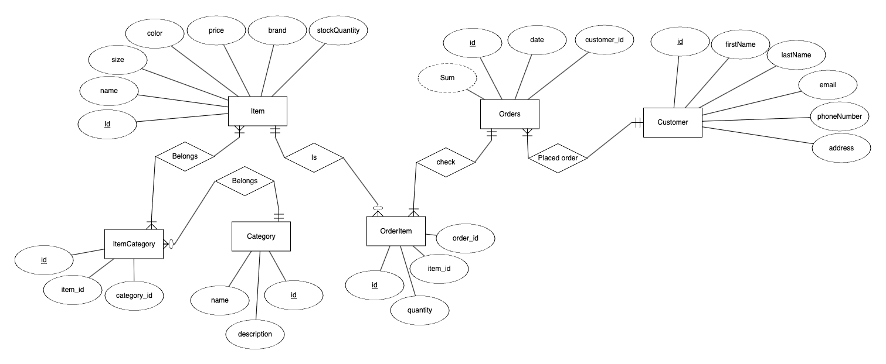

# SQL Webshop

## Description

 - SQL-Webshop is a simple Java-based application that simulates a web shop database system. 
 - The project serves as a demonstration of how to integrate Java with a relational database.
 - It allows querying customer orders, item categories, and other related information using SQL commands.

## Features
 - Query customer orders by different attributes
 - Retrieve item category counts
 - Calculate total order value for customers
 - Interactive command-line interface
 - JDBC integration for database operations


## Images

#### ER-Diagram



## How to run

### Prerequisites
 - Java Development Kit (JDK) 8 or higher
 - MySQL database server
 - MySQL JDBC Driver

1. Clone the repository to your local machine

```bash
git clone https://github.com/petterssonb/SQL-Webshop.git
```

2. Navigate to the project directory.

```bash
cd SQL-Webshop
```
3. Make sure:
- You have Java SDK

```bash
java --version
```

4. Create config.properties file in the root directory with the following content:

 - Create the file
```bash
touch config.properties
```
 - Add the following content to the file, and replace the placeholders with your own values.
 - Replace the "your_database" with the name of your database in the url.
```properties
url=jdbc:mysql://localhost:3306/your_database?serverTimezone=UTC&useSSL=false&allowPublicKeyRetrieval=true
user=your_username
password=your_password
```

5. Run the DDL and DML scripts in the database:
 - The scripts are located in the `databaseScripts` directory.
 - Run the DDL script first to create the necessary tables.
 - Run the DML script second to populate the tables with data.

6. Run the program by running Main.java


## License

Distributed under the MIT License. See `LICENSE` for more information.

## Acknowledgments
- [IntelliJ IDEA](https://www.jetbrains.com/idea/) - for the development environment
- [MySQL](https://www.mysql.com/) - for the database server